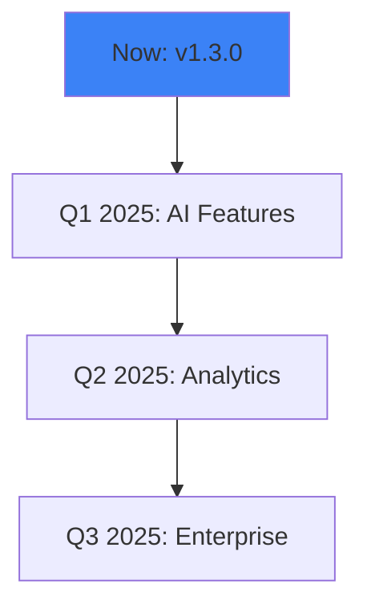

## Recent Updates

Stay current with Maycon Mota's evolution. You receive automatic notifications for major releases through your dashboard at `https://dashboard.example.com`. Review the details below to understand changes and plan your updates.

<Update label="2024-10-15" description="v1.3.0" tags={["feature", "improvement"]}>

## New Features

- Added real-time collaboration editing for documentation pages, allowing multiple users to edit simultaneously.
- Introduced webhook support for custom integrations: send events to `https://your-webhook-url.com/webhook`.

## Improvements

- Enhanced search performance by `>50%` with indexed full-text queries.
- Optimized image uploads, reducing load times for large assets.

## Bug Fixes

- Fixed sync issues between local edits and cloud storage.
- Resolved authentication token refresh errors during long sessions.

</Update>

<Update label="2024-09-20" description="v1.2.0" tags={["bugfix", "security"]}>

## Security Fixes

- Patched potential XSS vulnerabilities in markdown rendering.
- Strengthened API key validation to prevent weak token bypasses.

## Bug Fixes

- Corrected export failures for pages with embedded diagrams.
- Fixed mobile layout breaks in the editor preview mode.

## Improvements

- Added keyboard shortcuts for common actions like `<kbd>Ctrl</kbd>+<kbd>S</kbd>` to save.

</Update>

<Update label="2024-08-05" description="v1.1.0" tags={["feature", "breaking"]}>

## New Features

- Launched version control with git-like branching for docs.
- Integrated AI-powered content suggestions in the editor.

## Breaking Changes

- Updated config format: replace `apiEndpoint` with `baseURL`.

## Bug Fixes

- Stabilized page rendering for complex nested lists.

</Update>

## Upcoming Features

Get a preview of what's next. These enhancements focus on automation and extensibility.

<Columns cols={2}>

<Card title="AI Automation" icon="zap" href="#">

Coming soon: Auto-generate outlines and summaries using integrated AI models.

</Card>

<Card title="Advanced Analytics" icon="bar-chart" href="#">

Track page views, edit history, and user engagement metrics.

</Card>

<Card title="Custom Themes" icon="palette" href="#">

Full CSS customization with your brand color `#3B82F6`.

</Card>

<Card title="API v2" icon="code" href="/authentication">

Expanded endpoints for programmatic doc management.

</Card>

</Columns>

## Migration Guide

Follow these steps to update smoothly. Test in a staging environment first.

<Callout kind="alert">

Before updating, back up your project at `https://dashboard.example.com/backup`.

</Callout>

<Steps>

<Step title="Backup Your Data" icon="database">

Export all pages via the dashboard.

```bash
curl -H "Authorization: Bearer YOUR_TOKEN" https://api.example.com/v1/export > backup.json
```

</Step>

<Step title="Update Package" icon="download">

<CodeGroup tabs="npm,yarn">

````bash
npm install maycon-mota@latest
````

````bash
yarn add maycon-mota@latest
````

</CodeGroup>

</Step>

<Step title="Update Config" icon="settings">

For v1.1.0+, migrate your config:

````json
{
  "baseURL": "https://api.example.com",
  "apiKey": "YOUR_API_KEY"
}
````

</Step>

<Step title="Test Integration" icon="check-circle">

Verify endpoints:

<Request tabs="JavaScript,cURL">

````javascript
const response = await fetch('https://api.example.com/v1/docs', {
  headers: { Authorization: `Bearer ${YOUR_TOKEN}` }
});
````

````bash
curl -H "Authorization: Bearer YOUR_TOKEN" https://api.example.com/v1/docs
````

</Request>

</Step>

</Steps>

<Expandable title="Detailed Migration Notes" default-open="false">

If you encounter config errors post-update, clear your local cache and restart:

```bash
rm -rf node_modules/.cache
npm start
```

Check the full migration script at `https://dashboard.example.com/migrations/v1.3.0`.

</Expandable>

## Roadmap Preview



<Callout kind="tip">

Subscribe to updates via `https://dashboard.example.com/notifications` to get email alerts on releases.

</Callout>