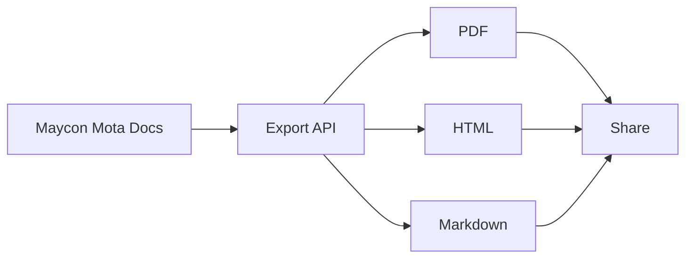

## Overview

Connect Maycon Mota to your favorite tools to automate workflows, sync content, and extend functionality. You can integrate with version control systems like GitHub, set up webhooks for real-time updates, embed external APIs, and export documentation in multiple formats. These integrations streamline your documentation pipeline.

<Columns cols={2}>
  <Card title="Version Control" icon="git-branch" href="#version-control">
    Sync changes from GitHub or GitLab automatically.
  </Card>
  <Card title="Webhooks" icon="zap" href="#webhooks">
    Receive instant notifications on events.
  </Card>
  <Card title="Embeddings" icon="link" href="#embeddings">
    Pull in dynamic content from external sources.
  </Card>
  <Card title="Exports" icon="download" href="#exports">
    Generate PDFs, HTML, or Markdown exports.
  </Card>
</Columns>

## Version Control Integration

Link your GitHub or GitLab repository to Maycon Mota for automatic documentation updates on commits or pull requests.

<Tabs>
  <Tab title="GitHub" icon="github">
    <Steps>
      <Step title="Create App" icon="settings">
        Go to your GitHub settings and create a new GitHub App. Note the App ID and generate a private key.
      </Step>
      <Step title="Configure in Maycon Mota" icon="link">
        Navigate to Integrations > GitHub in your dashboard. Enter the App ID, private key, and repository URL.
      </Step>
      <Step title="Enable Webhooks" icon="zap">
        Select events like `push` and `pull_request`. Maycon Mota generates the webhook URL for you.
      </Step>
    </Steps>
  </Tab>
  <Tab title="GitLab" icon="package">
    Follow similar steps in GitLab's project settings under Webhooks.
  </Tab>
</Tabs>

<Callout kind="tip">
  Test the integration with a sample commit to verify sync works end-to-end.
</Callout>

## Webhooks

Set up webhooks to trigger actions in Maycon Mota when external events occur, such as content updates.

Configure the webhook URL: `https://api.example.com/v1/webhooks/maycon-mota`.

<Request tabs="cURL,JavaScript" show-lines="true">
  ```bash
  curl -X POST https://api.example.com/v1/webhooks/maycon-mota \
    -H "Content-Type: application/json" \
    -H "Authorization: Bearer YOUR_API_KEY" \
    -d '{
      "event": "doc_updated",
      "repository": "user/repo",
      "path": "docs/intro.md"
    }'
  ```
  ```javascript
  const response = await fetch('https://api.example.com/v1/webhooks/maycon-mota', {
    method: 'POST',
    headers: {
      'Content-Type': 'application/json',
      'Authorization': 'Bearer YOUR_API_KEY'
    },
    body: JSON.stringify({
      event: 'doc_updated',
      repository: 'user/repo',
      path: 'docs/intro.md'
    })
  });
  ```
</Request>

<Response tabs="200,400">
  ```json
  {
    "status": "success",
    "webhook_id": "wh_1234567890",
    "processed": true
  }
  ```
  ```json
  {
    "error": "Invalid signature",
    "message": "Webhook signature mismatch"
  }
  ```
</Response>

Handle incoming payloads in your server:

<CodeGroup tabs="Node.js,Python">
  ```javascript
  app.post('/webhook', (req, res) => {
    const signature = req.headers['x-maycon-signature'];
    if (verifySignature(req.body, signature, process.env.WEBHOOK_SECRET)) {
      // Update documentation
      console.log('Doc updated:', req.body.path);
    }
    res.status(200).send('OK');
  });
  ```
  ```python
  from flask import Flask, request

  app = Flask(__name__)

  @app.route('/webhook', methods=['POST'])
  def webhook():
      signature = request.headers.get('X-Maycon-Signature')
      if verify_signature(request.data, signature, WEBHOOK_SECRET):
          print(f"Doc updated: {request.json['path']}")
      return 'OK', 200
  ```
</CodeGroup>

## Embedding External Content

Embed live data from APIs or iframes directly into your documentation pages.

Use the Embed component with a secure URL:

````jsx
<Iframe
  src="https://dashboard.example.com/widget/123"
  title="Live Analytics Dashboard"
  width="100%"
  height="400"
/>
````

<Callout kind="alert">
  Ensure embedded content uses HTTPS and respects CORS policies to avoid security issues.
</Callout>

## Exporting Documentation

Export your Maycon Mota site to various formats for sharing or archiving.



<Expandable title="Advanced Export Options" default-open="false">
  Customize exports with parameters like `theme` or `include_drafts`.

  ```bash
  curl -X POST https://api.example.com/v1/exports \
    -H "Authorization: Bearer YOUR_API_KEY" \
    -d '{
      "format": "pdf",
      "theme": "light",
      "pages": ["/introduction", "/quickstart"]
    }'
  ```
</Expandable>

<Columns cols={3}>
  <Card title="Quickstart" icon="rocket" href="/quickstart">
    Get started in minutes.
  </Card>
  <Card title="Authentication" icon="lock" href="/authentication">
    Secure your API access.
  </Card>
  <Card title="Changelog" icon="git-branch" href="/changelog">
    See latest updates.
  </Card>
</Columns>